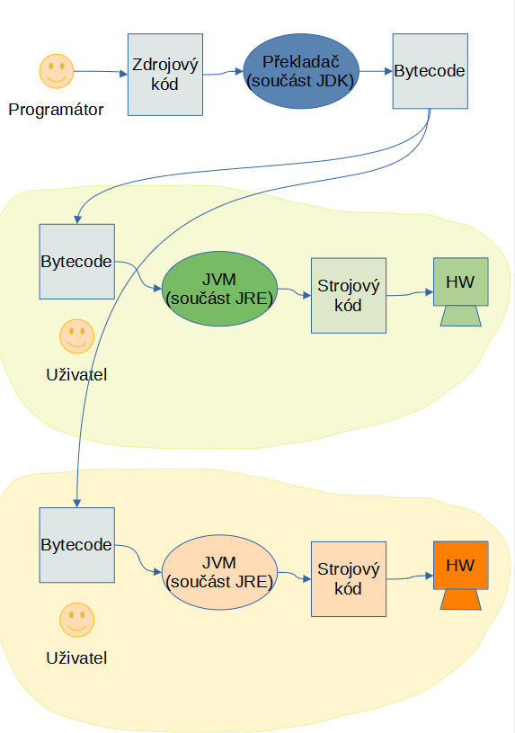

# Co je to Java?
 
 První vydání jazyka se datuje do roku 1995, vývoj však započal na začátku devadesátých let. 
 
 ## Překlad a bajtkód
 - Jazyk Java byl navržen jako řešení pro vývoj **platformně nezávislých programů**.
  - Program napsaný v Javě tedy jde spustit na libovolném z podporovaných operačních systémů (na Windows, v Linuxu, MacOS,...).
 - Proto má Java na rozdíl od ostatních jazyků rozdílný způsob překladu a spouštění. 
  - Většina jazyků se _překládá_ (_kompiluje_) přímo do sekvence instrukcí dané procesorové platformy, které zapíšeme do souboru (například soubor .exe ve Windows) a následně se tento soubor spouští. Java místo toho vytváří takzvaný _bajtkód_. To je sekvence instrukcí fiktivního procesoru. Tyto instrukce pak nelze spustit přímo přímo v&nbsp;procesoru počítače — spouští se ve virtuálním stroji, který se nazývá JVM (Java Virtual Machine). 
 
 - **Výhodou** tohoto přístupu je jeho **nezávislost na platformě**. Kdekoliv máš k&nbsp;dispozici JVM, můžeš spouštět jakýkoli program v&nbsp;Javě. 
 
 - Zároveň je to **omezení** — **bez JVM program nespustíš** a&nbsp;při spouštění je třeba aktivovat JVM, nestačí jen „kliknout“ na spustitelný program (resp. stačí, pokud je systém správně nastavený).

## Objektově orientovaný jazyk
Java je _objektově orientovaný jazyk._ To znamená, že Java není _čistě objektový jazyk_ &mdash; používá i&nbsp;primitivní datové typy, které nejsou reprezentovány jako objekty. 

# IDE, JDK, JRE a různé platformy

Jak to tedy v&nbsp;Javě funguje?

1. Vývojář napíše program (_zdrojový kód_)
    - K tomu využije vývojové prostředí (_IDE_), nebo jakýkoli textový editor.



## Garbage Collector a práce s&nbsp;pamětí
Java se proti mnoha jiným jazykům vyznačuje zejména bezpečností při správě paměti. Vývojář je plně odstíněn od práce s ní. Při práci s objekty využívá pouze reference (odkazy) a veškerou alokaci a uvolňování paměti řeší JVM, popřípadě Garbage Collector. (V tomto rysu je Java podobná jazyku C#.) Tím se:

- výrazně omezujeme riziko chyb, 

- ale práce s&nbsp;pamětí může být o&nbsp;méně efektivní po stránce rychlosti i&nbsp;potřebné kapacity paměti &mdash; spoléháme na „inteligenci“ Garbage Collectoru, nemůžeme činnost ovlivnit sami. 

## A jak zápis programu v&nbsp;Javě vypadá?

Tady je malá ukázka _zdrojového kódu_ v&nbsp;Javě &mdash; toto je zápis programu, který budeme vytvářet:

```java
// popis umístění - složka
package eng.nasprvniprogram;

class CoalMine {
  
  // deklarace proměnné WHAT_IS_IN_THE_MINE, do které zároveň přiřadíme hodnotu Some quality coal
  private static final String WHAT_IS_IN_THE_MINE = "Some quality coal";
  
  /*
   * metoda main je vstupní branou do Javovského programu, kterou musí obsahovat každý program
   * a ze které voláme všechny ostatní funkce
   */
  public static void main(String[] args) {
    // cyklus, který se provádí, dokud je splněna uvedená podmínka "i < 4"
    for (int i = 1; i < 4; i++) {
      // volání naší metody mine
      mine();
    }
  }
  
  /*
   * toto je naše úžasná metoda mine, která do dolů
   * pošle jednoho trpaslíka, aby přinesl to, co najde
   */
  private static void mine() {
    // System.out.println vypíše parametr, který mu předáme, do konzole
    System.out.println("We have mined: " + WHAT_IS_IN_THE_MINE + ".");
  }
}
```

## Shrňme si to

### IDE
_Integrated Development Environment_ je nástroj pro psaní zdrojového kódu. „Chytrý textový editor“, který má programátorovi usnadnit samotné psaní kódu. Často zahrnuje

- **editor** - textový editor speciálně navržený pro editování zdrojového kódu, zvládá zvýrazňovat syntax, formátovat kód, tak aby vyhovoval nastaveným konvencím a byl pro člověka, který kód edituje, čitelnější (v některé programovacích jazycích jde všechen kód napsat na jeden řádek a vše bude fungovat, ale pokud pak přijde potřeba změnit nějakou drobnost v kódu, tak se v jednořádkovém kódu nikdo nevyzná), umí našeptávat, zvýrazňovat chyby, či automaticky uzavírat závorky

- **debugger** - je nástroj, který programátorovi umožnuje zkoumat, proč jeho program (ne)funguje tak, jak jak funguje - do "podezřelých" částí kódu si totiž může přidávat "breakpointy" - body, ve kterých se provádění programu zastaví do doby, než je sám ručně pustí, případně nabízí možnost jít po jednotlivých příkazech a v každém bodě, ve kterém se zastaví, vypíše vždy svůj oktuální stav - hodnoty proměnných a to, jak do té části kódu, ve které se nachází, došel

- **kompilátor** - je nástroj, který překládá zdrojový kód zapsaný ve vyšším programovacím jazyce (který napíšeme my v editoru) do jazyka nižsího tak, aby mu rozumněl počítač - aby vznikl _bytecode_. V&nbsp;případě Javy je kompilátor je součástí JDK.

- **integrovaný verzovací systém** - některá IDE mají integrovaný i verzovací systém - o tom, co to verzovací systém je, si řekneme dále - u [GITu](#GIT) verzovacího systému, který budeme používat my

- <b>object browser</b> - prohlížeč komponent nacházejících se balíčcích softwaru, jejich hierarchii, metody a proměnné

- <b>nástroje pro tvorbu uživatelského rozhraní</b> - některá IDE obsahují i nástroje pro snadnou tvorbu uživatelského rozhraní

Některá vývojová prostředí jsou navržena přímo pro vývoj v konkrétním programovacím jazyce. Jiná podporují větší počet programovacích jazyků. My budeme používat _IntelliJ IDEA_. Její nejznámější alternativy (pokud jde o vývoj v&nbsp;Javě) jsou [Eclipse](https://www.eclipse.org/eclipseide/) a [NetBeans](https://netbeans.apache.org/)


## JDK
_Java Development Kit_ je soubor základních nástrojů pro **vývoj aplikací** v Javě od společnosti Oracle. Obsahuje kupříkladu překladač zdrojového kódu, debugger pro ladění programu, či nástroj pro tvorbu dokumentace. Dále také obsahuje JRE. 

## JRE
_Java Runtime Environment_ je soubor základních tříd a podpůrných souborů určený ke **spouštění Java aplikací**. Jestli jste hráli třeba Minecraft, nebo editovali nějaký dokument v&nbsp;OpenOffice, tak jste se již s JRE, byť nevědomky, setkali. JRE také obsahuje JVM.

JVM (_Java Virtual Machine_) je takzvaný interpeter - program, který náš program řádek pořádku provádí.

Instalujeme tedy:
 - <b>JDK</b> (+ JRE a JVM) pro vývoj Java aplikací
 - <b>JRE</b> (+ JVM) pokud chceme pouze spouštět Java aplikace

--- 

[Zpět na obsah lekce...](README.md)
